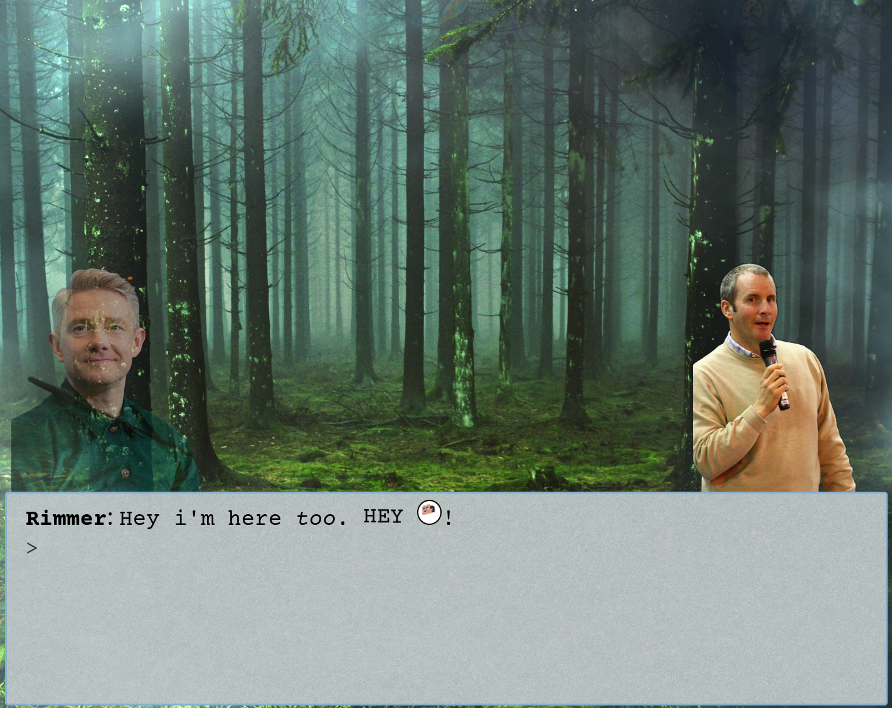

# The visual novel project
*A wacky story.*

## Screenshot



## What is it?

Romanetool is an [open-source](https://github.com/Pesopes/romanetool) project developed using [Svelte](https://svelte.dev/) and SvelteKit.

By writing a script using a custom syntax and providing your own assets, you can tell a story in the style of a visual novel. Afterwards, you can host this on your server (or just use it locally). Since everything is open source, you can completely change the UI or maybe add missing functionality specific to your story.

Each story is organized in a tidy folder, containing the script and all related assets. The game engine then reads this script to bring the story to life for the player.

While the project currently provides just one example scenario to help developers and writers understand the workflow, to add your own scenarios, you'll need to host your own instance of [Romanetool](https://github.com/Pesopes/romanetool).

## How It Came To Be

Romanetool was created as a way to allow anyone to share stories that were once limited only to their imagination.


## Credits
Some assets listed below are under third-party licenses (e.g., Creative Commons). The MIT license applies only to original code and content in this repository not these assets.
### Sound effects
- [Digital Audio Pack](https://kenney.nl/assets/digital-audio), Creative Commons CC0
- Intro music by [Universfield](https://pixabay.com/users/universfield-28281460/?utm_source=link-attribution&utm_medium=referral&utm_campaign=music&utm_content=153277)

### Example scenario assets
- Sherlock (Benedict Cumberbatch) – Fat Les (bellaphon) from London, UK, CC BY 2.0 <https://creativecommons.org/licenses/by/2.0>, via Wikimedia Commons (edited – removed background)
- Rimmer (Chris Barrie) – ...some guy, CC BY 2.0 <https://creativecommons.org/licenses/by/2.0>, via Wikimedia Commons (edited – removed background)
- Dr. Watson (Martin Freeman) – Harald Krichel, CC BY-SA 3.0 <https://creativecommons.org/licenses/by-sa/3.0>, via Wikimedia Commons, modified and distributed under the same license 
- Poirot – [original skin](https://t.novaskin.me/88f57c7c2cd4e701ca7a5433a7eaaba617416e73521cd52b4377c6bc1a515fad) screenshot and edit by me

## How to make custom scenarios
See [Custom scenarios guide](./CUSTOM_SCENARIOS_GUIDE.md)

## Developing

### first install dependencies
```bash
npm install
```

### run:
```bash
npm run dev
```

### build:
```bash
npm run build
```
You can preview the production build with `npm run preview`.

> To deploy your app, you may need to install an [adapter](https://svelte.dev/docs/kit/adapters) for your target environment.
